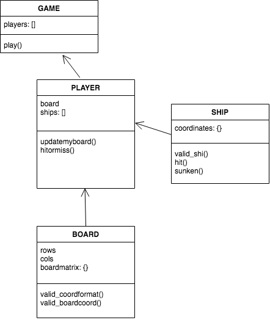

# Battleship Game project

For simplicity purposes, this version of the game only has 2 players per game.
Each player has a game board
Each player has only one ship
Ship size can only be 3 rows X 1 column, OR 1 row X 3 columns

Game setup information is stored in data.json; such as board size and initial ship placement

To run the game
execute ./game_run.sh. 
This will trigger automated unit tests first.

